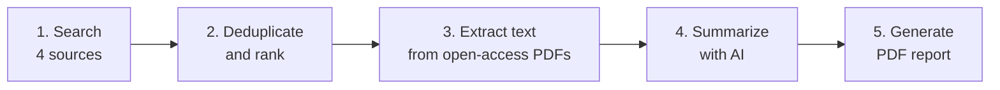
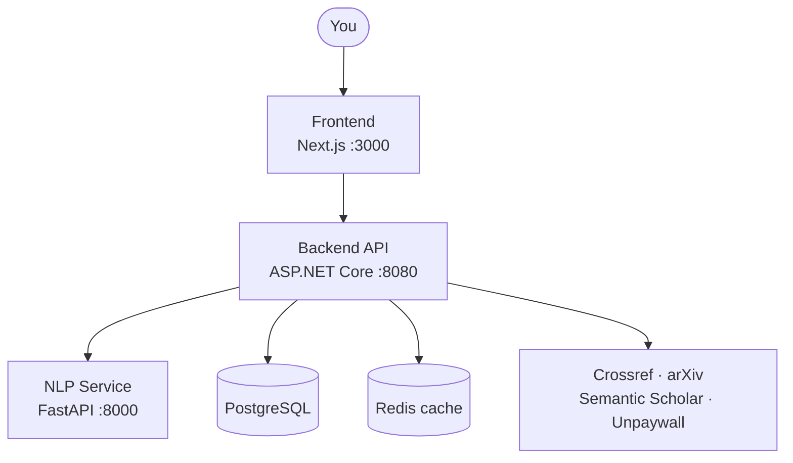

# ResearchRadar

**Type a research topic. Get a professional, referenced PDF report.**

ResearchRadar is a full-stack research assistant that finds academic papers, extracts their text, summarizes them with AI, and compiles everything into a branded report.

`Next.js 14` · `ASP.NET Core 8` · `FastAPI` · `PostgreSQL` · `Redis` · `Docker`

---

## Find What You Need

| I want to...                    | Go to                                       |
| ------------------------------- | ------------------------------------------- |
| Run it in a few minutes         | [Get Running](#get-running)                 |
| Search papers and make a report | [Using ResearchRadar](#using-ResearchRadar) |
| Understand how it works         | [How It Works](#how-it-works)               |
| Call the API from code          | [API Reference](#api-reference)             |
| Change settings                 | [Configuration](#configuration)             |
| Work on the code                | [Development](#development)                 |
| Fix a problem                   | [Troubleshooting](#troubleshooting)         |

---

## What It Does



| Capability               | Detail                                                                |
| ------------------------ | --------------------------------------------------------------------- |
| **Multi-source search**  | Crossref, arXiv, Semantic Scholar, and Unpaywall in one query         |
| **Smart deduplication**  | DOI matching plus title similarity                                    |
| **Open-access focus**    | Prioritizes freely available papers and extracts text from their PDFs |
| **AI summaries**         | TL;DR, key points, methods, results, and limitations                  |
| **Professional reports** | Branded PDFs with charts, comparison tables, and references           |
| **Modern UI**            | Responsive frontend with real-time search and filtering               |

---

## Architecture



| Service         | Stack                            | Responsibility                                     |
| --------------- | -------------------------------- | -------------------------------------------------- |
| **Frontend**    | Next.js 14, TypeScript, Tailwind | Search UI, filters, report options                 |
| **Backend**     | ASP.NET Core 8, EF Core          | Search, ranking, deduplication, ingestion, reports |
| **NLP Service** | FastAPI, transformers, pdfminer  | PDF text extraction and summarization              |
| **Database**    | PostgreSQL                       | Paper metadata                                     |
| **Cache**       | Redis                            | Response caching (24h TTL)                         |

### Repository Layout

```
ResearchRadar/
├── frontend/        # Next.js 14 + TypeScript + Tailwind
├── backend/         # ASP.NET Core 8 + EF Core + PostgreSQL
├── nlp-service/     # FastAPI + transformers + pdfminer
├── db/migrations/   # EF Core database migrations
├── infra/           # Docker Compose + environment config
├── docs/            # API documentation + demo reports
└── tests/           # Unit and integration tests
```

---

## Get Running

**You need:** Docker, Docker Compose, and Git.

**1. Clone and copy the environment file**

```bash
git clone <repository-url>
cd ResearchRadar
cp infra/.env.example infra/.env
```

**2. Set your Unpaywall email** in `infra/.env`

```env
UNPAYWALL_EMAIL=your-email@example.com
```

**3. Launch everything**

```bash
cd infra
docker compose up --build
```

**4. Open the app**

| Service            | URL                           |
| ------------------ | ----------------------------- |
| Frontend           | http://localhost:3000         |
| Backend API        | http://localhost:8080         |
| API docs (Swagger) | http://localhost:8080/swagger |
| NLP Service        | http://localhost:8000         |

---

## Using ResearchRadar

### Search for Papers

1. Open http://localhost:3000
2. Enter a topic, for example `digital twins in plastic injection molding`
3. Set filters: year range, open access only, max results
4. Click **Search Papers**

### Generate a Report

1. Select the papers you want from the results
2. Click **Generate Report**
3. Choose sections, charts, and language
4. Download the PDF

### Use the API Directly

```bash
# Search for papers
curl -X POST http://localhost:8080/api/search \
  -H "Content-Type: application/json" \
  -d '{
    "query": "digital twins manufacturing",
    "yearFrom": 2020,
    "yearTo": 2024,
    "limit": 25,
    "openAccessOnly": false
  }'

# Extract text from a PDF
curl -X POST http://localhost:8000/api/v1/extract-text \
  -H "Content-Type: application/json" \
  -d '{"pdf_url": "https://arxiv.org/pdf/2301.00001.pdf"}'

# Summarize text
curl -X POST http://localhost:8000/api/v1/summarize \
  -H "Content-Type: application/json" \
  -d '{
    "text": "Your paper text here...",
    "style": "technical",
    "lang": "en",
    "max_tokens": 1200
  }'
```

---

## How It Works

### Step 1: Search and Rank

Papers are collected from four sources, merged, and scored:

| Source               | Contributes                      |
| -------------------- | -------------------------------- |
| **Crossref**         | Comprehensive academic metadata  |
| **arXiv**            | Preprints and open-access papers |
| **Semantic Scholar** | AI-enhanced paper data           |
| **Unpaywall**        | Open-access PDF locations        |

```
Score = 0.6 × BM25(keywords) + 0.3 × Semantic_Similarity + 0.1 × Recency_Decay
```

| Component           | Weight | Meaning                                     |
| ------------------- | ------ | ------------------------------------------- |
| BM25                | 60%    | Keyword relevance in title and abstract     |
| Semantic similarity | 30%    | Contextual match (when available)           |
| Recency decay       | 10%    | Exponential decay that favors recent papers |

### Step 2: Remove Duplicates

| Check            | Rule                         |
| ---------------- | ---------------------------- |
| Exact DOI match  | Highest priority             |
| Title similarity | Jaro-Winkler above 0.92      |
| Author names     | Fuzzy match for verification |

### Step 3: Extract Text

| Setting       | Value                                |
| ------------- | ------------------------------------ |
| Tool          | `pdfminer.six`                       |
| Max file size | 50 MB                                |
| Quality check | Minimum character threshold          |
| Failures      | Graceful fallback for corrupted PDFs |

### Step 4: Summarize

1. **Chunk** the text by sentence (max 1,500 tokens per chunk)
2. **Pick a model:** English uses BART-large-cnn (or DistilBART in small mode); Chinese uses mT5-multilingual (planned)
3. **Produce structured output:**

| Output                        | Size                                              |
| ----------------------------- | ------------------------------------------------- |
| TL;DR                         | 60 words or fewer                                 |
| Key points                    | 3 to 8 bullets                                    |
| Methods, Results, Limitations | Per paper                                         |
| Keywords                      | Extracted with RAKE (language-specific stopwords) |

### Step 5: Build the Report

| Section              | Contents                                                     |
| -------------------- | ------------------------------------------------------------ |
| Cover Page           | Topic, date, branding                                        |
| Executive Summary    | Key findings across papers                                   |
| Methodology          | Search strategy and ranking algorithm                        |
| Literature Overview  | Categorized paper analysis                                   |
| Key Findings         | Synthesized insights                                         |
| Comparative Analysis | Paper-by-paper comparison table                              |
| Charts               | Publication trends, source breakdown, open-access statistics |
| Individual Summaries | Detailed per-paper analysis                                  |
| Gaps and Future Work | Research opportunities                                       |
| References           | APA format with DOI / QR codes                               |

**Customize:** pick sections and charts, choose English or Chinese, set your own logo, colors, and name, and export as PDF or HTML preview.

---

## API Reference

### Backend (`:8080`)

| Endpoint              | Purpose                           | Returns                                       |
| --------------------- | --------------------------------- | --------------------------------------------- |
| `POST /api/search`    | Find papers                       | Array of `SearchResult`                       |
| `POST /api/ingest`    | Fetch and process selected papers | Status per paper: success, skipped, or failed |
| `POST /api/summarize` | Summarize ingested papers         | Structured summaries                          |
| `POST /api/report`    | Generate a report                 | Report file                                   |
| `GET /health`         | Database connectivity             | Health status                                 |

**Request bodies**

```jsonc
// POST /api/search
{
  "query": "machine learning",
  "yearFrom": 2020,
  "yearTo": 2024,
  "limit": 25,
  "language": "en",
  "openAccessOnly": false
}

// POST /api/ingest
{ "paperIds": ["uuid1", "uuid2", "uuid3"] }

// POST /api/summarize
{
  "paperIds": ["uuid1", "uuid2"],
  "summaryStyle": "technical",
  "language": "en",
  "maxTokensPerPaper": 1200
}

// POST /api/report
{
  "topic": "AI in Manufacturing",
  "paperIds": ["uuid1", "uuid2"],
  "k": 10,
  "sections": ["cover", "executive", "findings"],
  "charts": ["by-year", "source-breakdown"],
  "language": "en"
}
```

### NLP Service (`:8000`)

| Endpoint                    | Purpose                     |
| --------------------------- | --------------------------- |
| `POST /api/v1/extract-text` | Extract text from a PDF URL |
| `POST /api/v1/summarize`    | Summarize text              |
| `GET /health`               | Model availability          |

---

## Configuration

### Backend: `backend/appsettings.json`

```json
{
  "ConnectionStrings": {
    "DefaultConnection": "Host=postgres;Database=ResearchRadar;Username=ResearchRadar;Password=ResearchRadar"
  },
  "ExternalApis": {
    "Crossref": { "BaseUrl": "https://api.crossref.org" },
    "Unpaywall": { "Email": "you@example.com" }
  },
  "Branding": {
    "Name": "ResearchRadar",
    "PrimaryColor": "#204ECF"
  }
}
```

### NLP Service

| Variable           | Example       | Purpose                                                |
| ------------------ | ------------- | ------------------------------------------------------ |
| `USE_SMALL_MODELS` | `true`        | Smaller models for development and low-memory machines |
| `MODEL_CACHE_DIR`  | `/app/models` | Where downloaded models are stored                     |
| `MAX_PDF_SIZE_MB`  | `50`          | Largest PDF accepted                                   |
| `MAX_TEXT_LENGTH`  | `1000000`     | Longest text processed                                 |

### Frontend

| Variable                 | Example                 |
| ------------------------ | ----------------------- |
| `NEXT_PUBLIC_API_URL`    | `http://localhost:8080` |
| `NEXT_PUBLIC_BRAND_NAME` | `ResearchRadar`         |

### Performance Tuning

| Situation       | Settings                                                                     |
| --------------- | ---------------------------------------------------------------------------- |
| **Low memory**  | `USE_SMALL_MODELS=true`, `MAX_CONCURRENT_REQUESTS=1`, `CHUNK_SIZE=512`       |
| **High volume** | `RATE_LIMIT_REQUESTS_PER_MINUTE=1000`, and `docker compose up --scale nlp=3` |

---

## Development

### Run Services Individually

| Service         | Commands                                                                                 |
| --------------- | ---------------------------------------------------------------------------------------- |
| **Backend**     | `cd backend/ResearchRadar.Api` then `dotnet run`                                         |
| **NLP Service** | `cd nlp-service` then `pip install -r requirements.txt` then `uvicorn main:app --reload` |
| **Frontend**    | `cd frontend` then `npm install` then `npm run dev`                                      |

### Database Migrations

```bash
cd backend/ResearchRadar.Api
dotnet ef migrations add MigrationName
dotnet ef database update
```

### Run Tests

| Service     | Command                                       |
| ----------- | --------------------------------------------- |
| Backend     | `cd backend/ResearchRadar.Api && dotnet test` |
| NLP Service | `cd nlp-service && pytest`                    |
| Frontend    | `cd frontend && npm test`                     |

---

## Operations

| Area              | What's in place                                                                                                                    |
| ----------------- | ---------------------------------------------------------------------------------------------------------------------------------- |
| **Logging**       | Serilog structured logs with correlation IDs; full request tracing; detailed error context                                         |
| **Caching**       | Redis, 24h TTL                                                                                                                     |
| **Rate limiting** | Configurable per-minute limits                                                                                                     |
| **Validation**    | FluentValidation; errors returned as structured ProblemDetails                                                                     |
| **CORS**          | Configurable origin restrictions                                                                                                   |
| **Containers**    | Non-root users, minimal Alpine-based images, CPU and memory limits in Docker Compose                                               |
| **Privacy**       | Temporary PDFs deleted after processing; metadata only, no full-text storage of copyrighted content; audit logging with timestamps |

---

## Troubleshooting

| Symptom                        | Fix                                                                                                                       |
| ------------------------------ | ------------------------------------------------------------------------------------------------------------------------- |
| **A service won't start**      | `docker compose logs backend` (or `nlp`, `frontend`), then `docker compose down && docker compose up --build`             |
| **Database connection errors** | `docker compose down -v`, then `docker compose up postgres -d`, wait for it to start, then `docker compose up backend`    |
| **Models fail to load**        | Check `docker compose logs nlp`, then `echo "USE_SMALL_MODELS=true" >> infra/.env` and `docker compose restart nlp`       |
| **Search returns nothing**     | Confirm the Unpaywall email in `.env`, check rate limits in the logs, try broader terms, or turn off **Open Access Only** |

---

## Roadmap

| Version  | Planned                                                                                                                          |
| -------- | -------------------------------------------------------------------------------------------------------------------------------- |
| **v1.1** | Enhanced Chinese support · Bulk PDF processing · Journal and impact-factor filters · User authentication and saved searches      |
| **v1.2** | Citation network analysis · Collaborative filtering recommendations · Real-time progress tracking · Export to reference managers |
| **v2.0** | Multi-language UI · Embedding-based semantic search · Research trend prediction · Institutional repository integration           |

---

## Contributing

1. Fork the repository
2. Create a branch: `git checkout -b feature/amazing-feature`
3. Commit: `git commit -m 'Add amazing feature'`
4. Push: `git push origin feature/amazing-feature`
5. Open a Pull Request

**Guidelines:** follow existing code style, add unit tests for new features, update docs for API changes, and test with Docker Compose before submitting.

---

## License

MIT License. See [LICENSE](LICENSE).

## Acknowledgments

[Crossref](https://www.crossref.org) · [arXiv](https://arxiv.org) · [Semantic Scholar](https://www.semanticscholar.org) · [Unpaywall](https://unpaywall.org) · [Hugging Face](https://huggingface.co)

---

> **Disclaimer:** ResearchRadar is for research synthesis only. Always verify findings against the original sources. The tool respects publisher terms of service and copyright restrictions.
